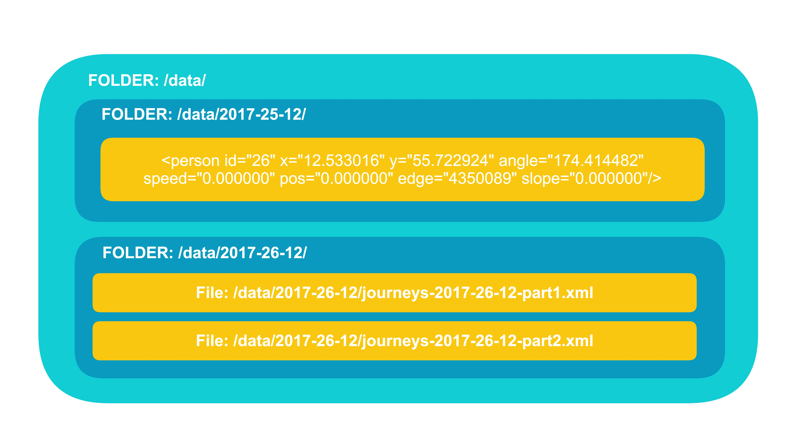
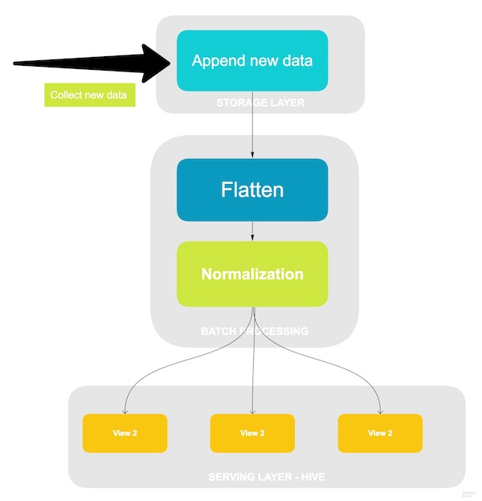
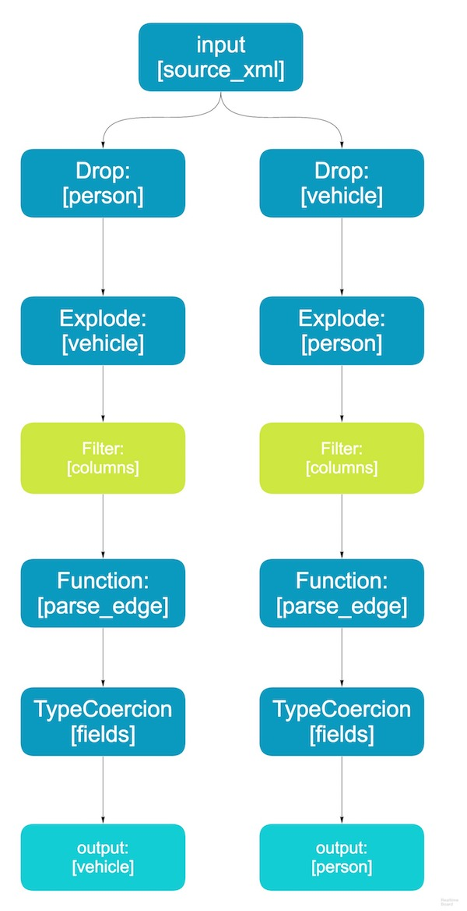
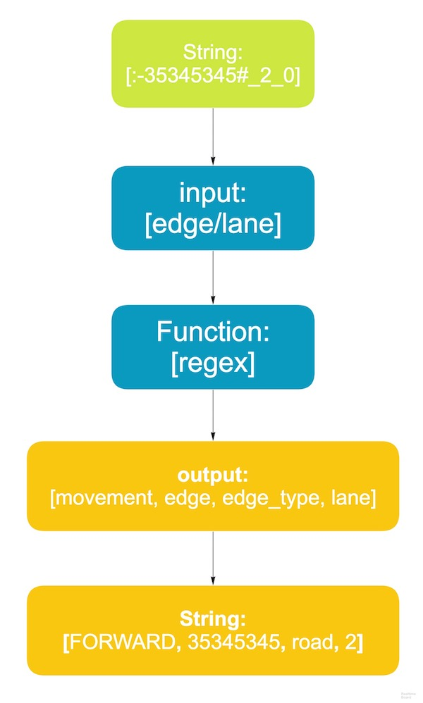
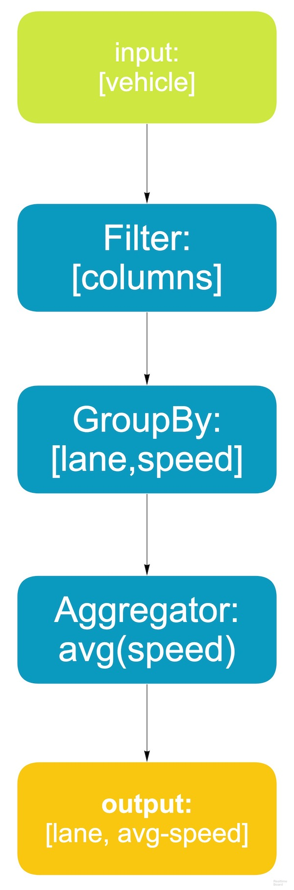
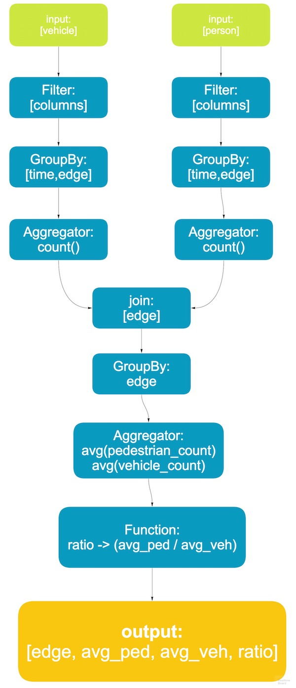

# Storage Layer

Before digging into the technical details of the storage layer, we concluded the most important goals of our architecture. We had to engineer that our master data set is absolutely corruption proof and fault tolerant which is the most essential part of the Lambda Architecture. The main components of the master dataset: the data model and how data is physically stored. We started by learning the key properties of data.

Data comes from the operations systems in xml formats on daily basis. When design our Big Data service, we wanted to ensure that we will be able to answer as many question as possible. Therefore we are storing the rawest data. Storing raw data allow us to maximize our ability to gain new insights, which were not considered when  examining the dataset. We understand that raw data entails more storage requirements and more resources but our service is design with the big data technologies (Hadoop Stack) which are able to manage large amount of data in a distributed, scalable manner.

```
    <timestep time="1.00">
        <vehicle id="0" x="12.537488" y="55.663405" angle="-18.966962" type="DEFAULT_VEHTYPE" speed="1.673759" pos="6.773759" lane="27409327_0" slope="0.000000"/>
 
```

There are number of different possibilities how to represent data within the master dataset. Given our limited time and resources we have chosen for simplicity to store data as we receive it originally in structure XML format. However we recommend the fact-based model, which is similar to datawarehouse models, where the data is deconstructed into units called facts. Facts are atomic, they can’t be subdivided further. If we have chosen a fact based mode it might look like this:


```
union Person {
    1: required PersonID id;
}

union PersonPropertyValue {
    1: 
}

union Vehicle {
    1: required Vehicle id;
}

```

It provides simple expressive representation of data. With a fact-based model, we would have gain numerous advantages. For instance it supports the evolution of the kinds of data stored in the master dataset, because the data from the source may change over the time. This is a crucial property, it would have add whole new capabilities to our system, because the “business” requirements  might change and we would need to add new kinds of data and handle this changes effortlessly as possible.

One of the key advantages to represent data in the master dataset using schemas we experienced when implementing the storage layer. The goal was to easily and effectively manage large (growing) dataset. First we have decided for simplicity to use the low-level HDFS API to manage our storage layer. Although we haven’t done any denormalization for performance issues we exploited the files and folders abstraction to improve storage of the master dataset with vertical partitioning. Vertical partitioning enabled large performance gains, we can access data which is relevant to the computation, therefore we don’t need to access the entire dataset. Vertical partitioning of data is done by sorting the data into separate folders in the distributed file system.



We vertically partition the data by day, we create a separate folder for each day of data. Each day a cron job is downloading the data from the source system and afterwards a Scala script is scheduled which appends the new data to hdfs. The Scala script is just using the files-and-folders API of hdfs, thus easily certain bugs and mistakes can break the vertical partitioning constraints of a dataset. This indicated that using hdfs API directly is too low-level of an abstraction for such a task like vertical partitioning in production. All kinds of operations and checks need to happen to correctly manage the dataset thus we have moved to higher-level abstraction solutions which are not only scalable, fault-tolerant and performant, but elegant as well are a necessity.

An alternative solution to our problem have been solved with a library called Pail (dfs-datastores). Pail keeps metadata about the dataset. By using metadata, Pail abstracts the low-level API and allow us to significantly improve the management of a dataset without worrying about violating it’s integrity.

That concludes the storage layer. Moving towards higher abstraction libraries like Pail we could easily manage dataset on a distributed filesystem, while isolating from the details of the filesystem and violations of the dataset integrity.


# Batch Layer


### Motivation (Views)

**View 1: Identify the roads with the highest average speed to place speed cameras:** 

Installing speed cameras (traffic enforcement cameras) on high-speed roads to monitor driving and speeding habits is a way to control drivers and reduce the risk of speeding offences which could lead to more serious incidents. Our strategy is to identify these roads/streets and have an overview of these areas that could pose more risk to both pedestrians and drivers to be able to make this plan go forth.

**View 2: Identify roads with the highest pedestrian/vehicle ratio:**

This view provides an overview of which areas are most condensed with people and vehicles in order to have a map of streets that are going to be allocated to only pedestrians like Strøget in Copenhagen. So basically we are identifying new streets to add to the pedestrians-only club. Pedestrianised streets are very useful to the communities in terms of culture and tourism, as well as giving people more freedom for shopping. The success story of Strøget can pave the way for some other places to function car-free. 

**View 3: Identify the ‘most travelled’ roads:**

Damaged roads could lead to road accidents (Washingtonpost 2009). These cases could be fatal for the passengers as well as expensive for the state if the victims file lawsuits (Mirror 2017). Our third view is to minimize the risk of car accidents due to poor road conditions. So the strategy here is to identify the most driven/used roads and prioritize road maintenance based on the data. This can be a very fast and efficient way to provide a better service for drivers and a safer city to live in for the residents. This is also a good example of data-driven service providing, where the data creates a cheaper solution to serve the city. This system can eliminate the old-fashioned and expensive way of handling road maintenance where the city authorities had to wait for a failure or a complaint in order to be able to identify bad roads.

### Computing on Batch Layer

Batch layer precomputes the master dataset into batch views so that our presentation layer (Tableu) can query data and present at low latency. An high level overview can be seen in the picture:

Since the batch layer runs different transformation on the entire master dataset to precompute our views and we assume that our dataset is growing over time we had to come up with a feasible solution to avoid massive performance cost.

#### Recomputation and increamental
Our big data solution supports both recomputation and incremental algorithms.

* **Recomputation** - each time a new data is added to the master dataset the old views are deleted and recomputed on the entire master dataset. This task requires massive computational effort, which results in low latency but it's essential that we ensure data integrity.
* **Incremental** - in contranst the incremental approach only process the new comming data and updates our views. This solution requires much less computational resources, and increase the effiency ouf our system, but requires more algorithm complexity.

The key trade-offs between two approaches are performance and data consistency. The incremental approach provide additional efficiency, but we also partioned the storage layer, we can easily identify when our dataset get corrupted and run the batch computation on the slice of the master dataset. 


## Batch Procesing

We design the batch layer that loads data from the storage layer (HDFS), enforces data quality, consistency and delivers our views into serving layer.



### Flattening

The following pipe diagram depicts the specific algorithms and data processing transformation:



Input Schema:

```
+----+--------------------+--------------------+
|time|              person|             vehicle|
+----+--------------------+--------------------+
| 0.0|[[null,179.75651,...|[[null,-18.966962...|
| 1.0|[[null,-107.01505...|[[null,-18.966962...|
| 2.0|[[null,75.774036,...|[[null,161.707365...|
+----+--------------------+--------------------+
``` 


### Semantic Normalization
We come across a form of data such as an unstructured *lane/edge* string. In order to get as much knowledge as possible we used semantic normalization to reshape the unstructured *lane/edge*. Which is a function that takes the *lane* or *edge* as string and normalized it to (movement, edge, edge_type, edge_lane). Yet this simple semantic normalization may have not be 100% correct since our (meta) information about the this data field is vague, later on we can improve our algorithm and run the batch recomputation. The following diagram describes the function:




### Computing batch views

At this stage the data is ready to compute the batch views. The key point is the flexibility to run arbitraly functions in parallel on all the data.

##### View1: Average Speeding (over time)
As outlined earlier, the 1st batch view should identify the roads with the highest average speed. Therefore the view have to aggregate the "visits/journeys" for each road (edge/lane). If we would have a valid *timestamp* we could approach this problem with hourly, daily, weekly etc. granularities. Since we have normalized our dataset, it reduced the size of the data we have to traverse.

Pipe Diagram of view1:



##### View2: pedestrian-vehicle ratio

The 2nd batch view computes the pedestrian-vehicle ration for each edge. We compute the total number of visits for each domain - vehicle, pedestrians. Tracing each visit a pedestrian, vehicle made as they passed by an edge. After counting all the visits at each domain we simply dived the two fields and get the ratio results.

Pipe Diagram of view2:




# Serving Layer

The serving layer serves the precomputed batch views. In our implementation we have used Apache Hive. Which enabled us to manage our views in a distributed manner. The key advantage of choosing Hive it's easible access to data via SQL and it's ability organizing tables into partitions. For example in our 1st view we are aggregating the entire data set to get the average speed at each edge point, but suppose we need to retrieve the average speed detail by a given timestamp. Hive allows to partitione the vehicle data with year, month, week, day etc. granuality which reduces the query processing time. 


### LoadXML

```
scala> xml.printSchema
root
 |-- time: double (nullable = true)
 |-- person: array (nullable = true)
 |    |-- element: struct (containsNull = true)
 |    |    |-- _VALUE: string (nullable = true)
 |    |    |-- _angle: double (nullable = true)
 |    |    |-- _edge: string (nullable = true)
 |    |    |-- _id: long (nullable = true)
 |    |    |-- _pos: double (nullable = true)
 |    |    |-- _slope: double (nullable = true)
 |    |    |-- _speed: double (nullable = true)
 |    |    |-- _x: double (nullable = true)
 |    |    |-- _y: double (nullable = true)
 |-- vehicle: array (nullable = true)
 |    |-- element: struct (containsNull = true)
 |    |    |-- _VALUE: string (nullable = true)
 |    |    |-- _angle: double (nullable = true)
 |    |    |-- _id: long (nullable = true)
 |    |    |-- _lane: string (nullable = true)
 |    |    |-- _pos: double (nullable = true)
 |    |    |-- _slope: double (nullable = true)
 |    |    |-- _speed: double (nullable = true)
 |    |    |-- _type: string (nullable = true)
 |    |    |-- _x: double (nullable = true)
 |    |    |-- _y: double (nullable = true)
 ```


